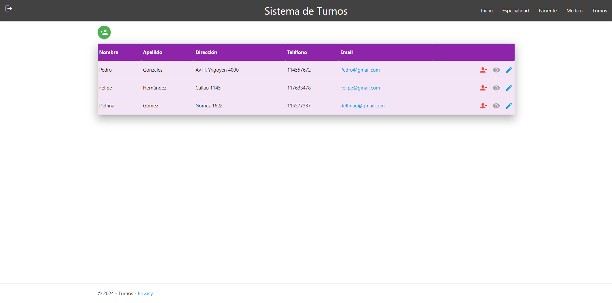

# Sistema de Turnos – ASP.NET Core MVC

Aplicación para gestionar turnos (crear, editar, cancelar), con ABM de médicos, pacientes y especialidades.

## Stack
- ASP.NET Core MVC · C#
- Entity Framework Core
- Identity (autenticación)
- SQL Server
- Bootstrap

## Funcionalidades
- Turnos: alta/edición/cancelación con validaciones
- ABM de médicos, pacientes y especialidades
- Autenticación con Identity
- Listados con búsqueda/filtros
- Vistas responsive (Bootstrap)

## Capturas

- Vista Inicio

- Asignar Turno

- Agregar Medico

- Vista Paciente

## Ejecutar local
1. Configurá la cadena de conexión en `appsettings.json` o `appsettings.Development.json`.
2. Aplicá migraciones (si corresponde):  
   `dotnet ef database update`
3. Ejecutá:  
   `dotnet run`
